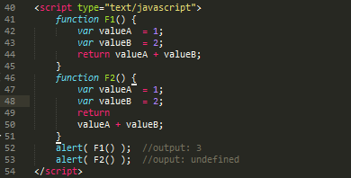

## 前端开发规范

#### 1. 命名规则

##### 1.1 文件资源命名

- 项目名称全部采用小写，以连词线分割。如：my-project
- 文件名不能用汉语拼音（alibaba、taobao 等除外）
- 文件名不得含有空格
- 文件名只使用小写字母，不使用大写字母，有复数结构时，要采用复数命名法。 ( 为了醒目，某些说明文件的文件名，可以
使用大写字母，比如 README、 LICENSE。 )
- 文件名包含多个单词时，单词之间使用半角的连词线 ( - ) 分隔。

```
不推荐：
views
 |-financeSupermarket
 
推荐：
views
 |-finance-supermarket
```

- 引入资源使用相对路径，不要指定资源所带的具体协议（ HTML 编码规范），除非 http:、
https:这两者协议都不可用。

```
不推荐：
<script src="http://cdn.com/foundation.min.js"></script>

推荐：
<script src="//cdn.com/foundation.min.js"></script>
```

##### 1.2 变量命名

- 命名方式 : 小驼峰式命名方法

```
Pascal Case 大驼峰式命名法：首字母大写。eg：StudentInfo、UserInfo、ProductInfo
Camel Case 小驼峰式命名法：首字母小写。eg：studentInfo、userInfo、productInfo
```

```
let FirstName; // 不推荐
let first_name; // 不推荐
let firstName; // 推荐
```

- 命名规范 : 类型+对象描述的方式，如果没有明确的类型，就可以使用前缀为名词

类型 | 小写字母
---|---
array | a
boolean | b
function | fn
int | i
object | o
regular | r
string | s

```
不推荐:
var getTitle = "LoginTable"

推荐:
var tableTitle = "LoginTable"
```

```
Object String Array Int
Eg: oPerson,sPersonName,aPersonList,iPersonId
```

- 控制变量名的长度

一般来说，变量名应该尽量不超过三个单词，我们可以使用一些众所周知的缩写词，例如：

单词 | 缩写
---|---
document | doc
evaluation | eval
current | cur
array | arr
length | len
string | str
number | num

不应该使用自己创造的缩写词，免得给人造成困扰，比如：

单词 | 缩写
---|---
password | pw
comment | comt
distribute | dist
extract | ext
component | cpt

```
不推荐:
function convertStringToNumber(){} // 将字符串转换为数字类型

推荐：
function str2Num(){}
```

- 类或对象的私有属性，应该以`_`开头

##### 1.3 方法命名

- 命名方式 : 小驼峰方式 ( 类名和构造函数使用大驼峰命名法 )
- 命名规范 : 前缀为动词
- 对于函数和方法命名，第一个单词应该是动词；常见的一些使用动词的约定

动词 | 含义 | 返回值
---|---|---
can | 判断是否可执行某个动作 ( 权限 ) | 函数返回一个布尔值。true：可执行；false：不可执行
has | 判断是否含有某个值 | 函数返回一个布尔值。true：含有此值；false：不含有此值
is | 判断是否为某个值 | 函数返回一个布尔值。true：为某个值；false：不为某个值
get | 获取某个值 | 函数返回一个非布尔值
set | 设置某个值 | 无返回值、返回是否设置成功或者返回链式对象
fetch | 获取远程数据 | 返回列表数据

```
//是否可阅读
function canRead(){
    return true;
}

//获取姓名
function getName{
    return this.name
}
// 从网络中获取数据
function fetchPageData(){}
``` 

```
Eg: getUserInfo,updateUserInfo,handleSearch,handleForm
```

##### 1.4 常量命名

- 命名方法 : 全部大写
- 命名规范 : 使用大写字母和下划线来组合命名，下划线用以分割单词。

```
Eg: SET_USERINFO (vuex)
```

##### 1.5 其它

- 若存在其他特殊约定的，以约定为准。

#### 2. 书写规范
- 缩进

在同一系统中应采用同一种缩进标准，本文提倡缩进大小为2个空格。各编译器对Tab键所代替的空白大小定义不同。建议在设置开发环境时，将编辑器里的Tab快捷键重新设置成2个空格。多数编译器提供了此功能。否则建议按2次空格来进行缩进。

- 换行

在以下位置必须换行：

每个独立语句结束后；

if、else、catch、finally、while等关键字前；

运算符处换行时，运算符必须在新行的行首。 

对于因为单行长度超过限制时产生的换行，参考行长度中的策略进行分隔。

- 字符串过长截断

每行代码应小于80个字符。若代码较长应尽量换行，换行应选择在操作符和标点符号之后，最好是在分号“;”或逗号“,”之后。下一行代码相对上一行缩进2个空格。这样可以有效防止复制粘贴引起的代码缺失等错误并增强可读性。

按一定长度截断字符串，并使用+运算符进行连接。分隔字符串尽量按语义进行，如不要在一个完整的名词中间断开。特别的，对于HTML片段的拼接，通过缩进，保持和HTML相同的结构：


也可使用数组来进行拼接，相对+运算更容易调整缩进：


- 三元运算符过长

三元运算符由3部分组成，因此其换行应当根据每个部分的长度不同，形成3种不同的情况：


不得出现以下情况：


- 过长的逻辑条件组合

当因为较复杂的逻辑条件组合导致80个字符无法满足需求时，应当将每个条件独立一行，逻辑运算符放置在行首进行分隔，或将部分逻辑按逻辑组合进行分隔。最终将右括号)与左大括号{放在独立一行，保证与if内语句块能容易视觉辨识。如：


- 过长的JSON和数组

如果对象属性较多导致每个属性一行占用空间过大，可以按语义或逻辑进行分组的组织，如：


通过5个一组的分组，将每一行控制在合理的范围内，并且按逻辑进行了切分。 对于项目较多的数组，也可以采用相同的方法，如：




#### 3. 开发工具

3.1 插件

#### 4. HTML 规范


#### 5. CSS 规范


#### 6. JavaScript 规范


#### 7. 注释规范


#### 8. Vue 项目规范

- 目录下的默认文件为 index，比如：index.js、index.vue


